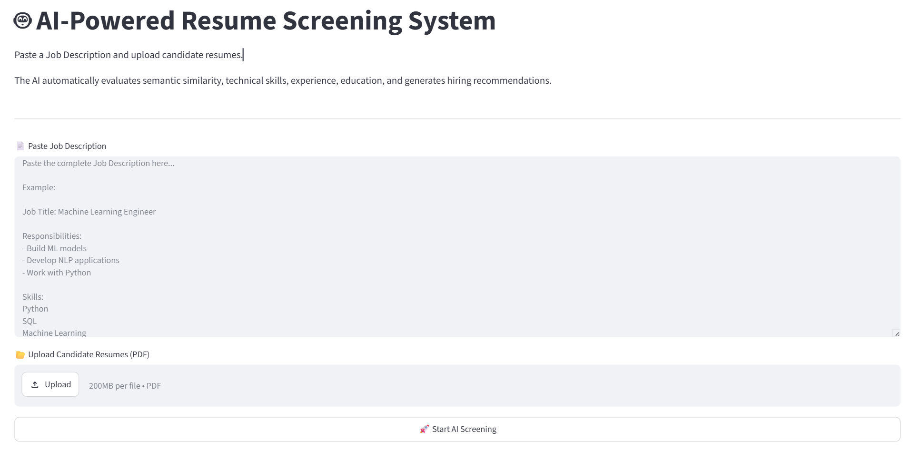
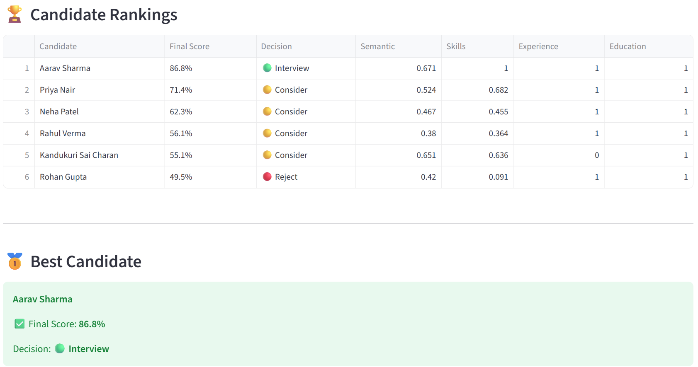
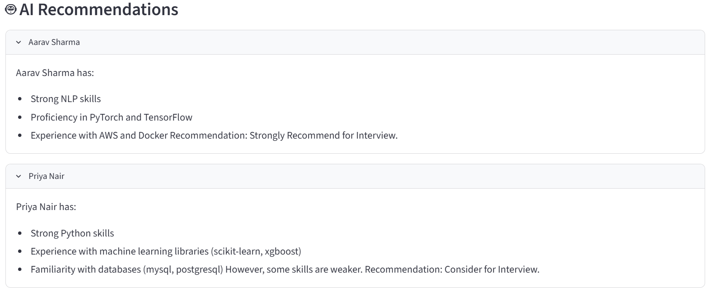

# 🤖 AI-Powered Resume Screening System

An AI-powered Resume Screening System that automatically evaluates resumes against a Job Description using NLP, semantic similarity, skill matching, experience analysis, education scoring, and LLM-based hiring recommendations.

Built using **Python**, **Sentence Transformers**, **Groq LLM**, and **Streamlit**.

---

# 🚀 Features

✅ Paste any Job Description

✅ Upload multiple resumes (PDF)

✅ Semantic Similarity using Sentence Transformers

✅ Skill Matching

✅ Experience Scoring

✅ Education Scoring

✅ Weighted Candidate Ranking

✅ AI-generated Hiring Recommendations using Groq LLM

✅ Interview / Consider / Reject Decision

✅ CSV Export

---

# 🛠 Tech Stack

- Python
- Streamlit
- Sentence Transformers
- HuggingFace
- Groq LLM
- Pandas
- PyPDF2
- Scikit-learn

---

# 🧠 How It Works

The application follows these steps:

1. User pastes a Job Description.
2. Uploads multiple resumes.
3. Extracts text from each PDF.
4. Computes semantic similarity.
5. Matches technical skills.
6. Scores experience.
7. Scores education.
8. Calculates weighted final score.
9. Generates AI hiring recommendation using Groq.
10. Displays ranked candidates.

---

# 📊 Scoring Formula

| Component | Weight |
|-----------|--------|
| Semantic Similarity | 40% |
| Skill Match | 30% |
| Experience | 20% |
| Education | 10% |

Final Score

```
0.4 × Semantic
+ 0.3 × Skills
+ 0.2 × Experience
+ 0.1 × Education
```

---

# 🖥 Screenshots

## Home Page



---

## Candidate Rankings



---

## AI Recommendations



---

# 📂 Project Structure

```
Resume-Screening-Agent
│
├── parser.py
├── scorer.py
├── llm.py
├── app.py
├── streamlit_app.py
├── requirements.txt
│
├── utils
│   ├── skills.py
│   ├── experience.py
│   ├── education.py
│   └── exporter.py
│
├── resumes
├── outputs
├── screenshots
└── README.md
```

---

# ⚙ Installation

Clone the repository

```bash
git clone https://github.com/yourusername/Resume-Screening-Agent.git
```

Install dependencies

```bash
pip install -r requirements.txt
```

Create a `.env`

```text
GROQ_API_KEY=your_api_key
```

Run Streamlit

```bash
streamlit run streamlit_app.py
```

---

# 🎯 Future Improvements

- Resume parsing using OCR
- ATS compatibility score
- Resume keyword highlighting
- Skill gap analysis
- Recruiter dashboard
- Resume summarization
- Support DOCX resumes
- Cloud deployment with authentication

---

# 👨‍💻 Author

**Kandukuri Sai Charan**

Live App: https://ai-resume-screening-agent-7xfawytf2pnggpbryovfuq.streamlit.app/

LinkedIn: https://www.linkedin.com/in/sai-charan-kandukuri-16a766245/

GitHub: https://github.com/charan17kk/
